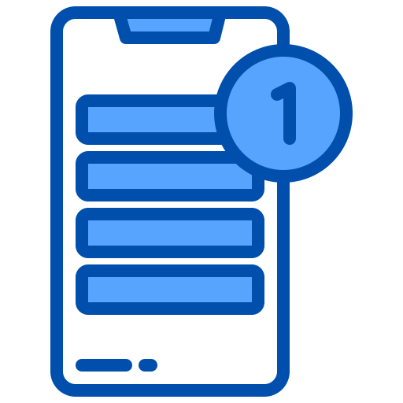

<p align="center">
  
</p>

<h1 align="center">Job Alert</h1>

<p align="center">
  <a href="#overview">Overview</a> |
  <a href="#features">Features</a>
</p>

## Overview

여러 채용 사이트의 정보를 모아 메일 또는 슬랙으로 알려주는 채용 알림 서비스

여러 채용 사이트의 정보를 가져와 키워드별로 신규 채용건 혹은 갱신 채용건을 알려준다.

## Feature

### 제공 사이트

- 로켓펀치
- 원티드

### 제공 알림 채널

- 이메일 ( SENDGRID )

## Environment

| Environment Variable                 | Development Default                          | Production Default        |
| ------------------------------------ | -------------------------------------------- | ------------------------- |
| SENDGRID_API_KEY                     |  n/a                                         | raise error               |

## Settings

`sources/settings.yaml` 파일을 통해 크롤러의 설정 값을 변경 할 수 있다.

```yaml
extensions:  # 사용 가능한 확장팩 및 공통 설정을 나열하는 설정
    search_engines:  # 사용 가능한 검색 엔진
      rocket_punch: {}
      wanted: {}
    channels:  # 사용한 결과를 전송할 수단
    slack: {}
    send_grid:
      sender: <email>  # 결과를 전송할 이메일 주소
 
users:
  - user: <username>  # 설정을 저장할 유저의 이름
    search_engines:  # 검색엔진으로 사용할 설정 
      rocket_punch: {}
      wanted: {}
    channels:
      send_grid:
        recipient:
          - tech@ashe.kr
    keywords:  # 검색어로 지정할 것
      - django,ai  # 여러 태그를 AND 검색 하고싶다면 콤마로 구분한다. 
      - other_tag
```

## How Does it Work?

Github CI 에 스케쥴로 등록되어 자동으로 신규 채용건을 수집한다.

신규 채용건임을 알기 위해 최신 순으로 정렬된 채용 데이터를 받고, 최신 채용 ID 를 파일에 기록한다.
이후 최신순으로 정렬하고 파일에 저장된 최신 채용 ID 이 나타낼까지 데이터를 긁어 모아 알림을 보내고 다시 최신 채용 ID 를 기록하고를 반복한다.

## 새 크롤러를 추가하는 법

`sources/app/crawlers/__init__.py` 파일의 `BaseCrawler` 를 상속하여 크롤러를 생성한다.
`NotImplementError`, `assert` 로 실패하는 것들을 찾아 구현한다.

크롤러를 구현했으면 `sources/app/run.py` 의 `SEARCH_ENGINES` 의 형식에 맞춰 크롤러를 넣어준다.
이후부터 해당 크롤러를 동작시키기 위해 `settings.yaml` 의 `search_engine` 에 `SEARCH_ENGINS` 의 키를 넣는다.

## 알림 시간을 변경하는 법

`.github/workflows/auto-run.yml` 파일의 `on - schedule - cron` 을 변경한다.
